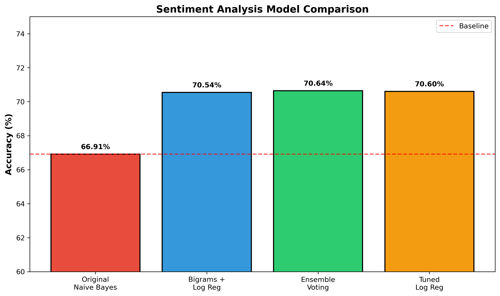
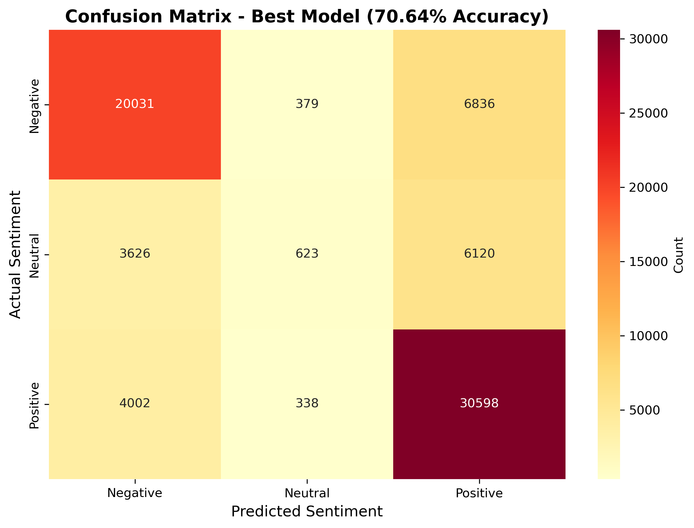

# Drug Review Sentiment Analysis & Recommender System 💊

A machine learning project that performs sentiment analysis on drug reviews and recommends medications based on patient conditions.

## 📊 Project Overview

- **Dataset**: 362,763 WebMD drug reviews
- **Task 1**: Sentiment Analysis (Positive/Negative/Neutral classification)
- **Task 2**: Drug Recommendation System based on patient conditions

## 🎯 Results

### Sentiment Analysis Performance
- **Best Model**: Ensemble Voting (Logistic Regression + LinearSVC + Random Forest)
- **Final Accuracy**: 70.64%
- **Improvement**: +3.73% from baseline (66.91%)

| Model | Accuracy | Improvement |
|-------|----------|-------------|
| Baseline (Naive Bayes) | 66.91% | - |
| Bigrams + Logistic Regression | 70.54% | +3.63% |
| **Ensemble Voting** | **70.64%** | **+3.73%** ✓ |

### Drug Recommender System
- **Conditions Covered**: 671 medical conditions
- **Drugs Available**: 2,191 unique medications
- **Recommendation Algorithm**: Weighted scoring based on effectiveness (40%), satisfaction (30%), ease of use (20%), and popularity (10%)

## 🛠️ Technologies Used

- **Python 3.x**
- **Libraries**: pandas, numpy, scikit-learn, nltk, matplotlib, seaborn, imbalanced-learn
- **Models**: Naive Bayes, Logistic Regression, LinearSVC, Random Forest, Ensemble Voting
- **NLP Techniques**: TF-IDF vectorization, lemmatization, bigrams, stopword removal

## 📁 Project Structure

├── Drug_Review_Analysis.ipynb # Main analysis notebook
├── data/
│ ├── drug_recommendations.csv # Final recommendation data
│ ├── drug_recommendations_final.csv
│ └── sample_processed_reviews.csv # Sample of processed data
├── models/
│ ├── sentiment_model_ensemble.pkl # Trained ensemble model
│ ├── sentiment_model_best.pkl
│ ├── vectorizer_ensemble.pkl # TF-IDF vectorizer
│ └── vectorizer_best.pkl
├── confusion_matrix.png # Model performance visualization
├── model_comparison.png # Accuracy comparison chart
├── requirements.txt
└── README.md

**Note**: Large dataset files (360MB+) are excluded from the repository due to GitHub size limits. Download the original dataset from [Kaggle](https://www.kaggle.com/datasets/rohanharode07/webmd-drug-reviews-dataset).

## 🚀 Getting Started

### Installation

Clone the repository
git clone https://github.com/margueritteee/drug-review-analysis.git
cd drug-review-analysis

Install required packages
pip install -r requirements.txt

### Download NLTK Data
import nltk
nltk.download('punkt')
nltk.download('stopwords')
nltk.download('wordnet')
nltk.download('omw-1.4')

### Download Dataset
Download the full dataset from [Kaggle](https://www.kaggle.com/datasets/rohanharode07/webmd-drug-reviews-dataset) and place `webmd_drug_reviews.csv` in the project directory.

## 💻 Usage

### Sentiment Analysis Example
import pickle

Load trained model
with open('models/sentiment_model_ensemble.pkl', 'rb') as f:
model = pickle.load(f)

with open('models/vectorizer_ensemble.pkl', 'rb') as f:
vectorizer = pickle.load(f)

Predict sentiment
review = "This medication works great with minimal side effects"
review_vec = vectorizer.transform([review])
sentiment = model.predict(review_vec)
print(f"Sentiment: {sentiment}") # Output: positive

### Drug Recommendation Example
import pandas as pd

Load recommendations
recommendations = pd.read_csv('data/drug_recommendations.csv')

Get top 5 drugs for Depression
condition = 'Depression'
top_drugs = recommendations[
recommendations['Condition'].str.contains(condition, case=False)
].head(5)

print(top_drugs[['Drug', 'Avg_Effectiveness', 'Avg_Satisfaction', 'Recommendation_Score']])

## 📈 Key Findings

1. **Bigrams improved accuracy by 3.63%** - Capturing phrase context like "not good" significantly improved classification
2. **Logistic Regression outperformed Naive Bayes** - Better suited for this text classification task
3. **Ensemble methods provided consistent improvements** - Combining multiple models boosted accuracy to 70.64%
4. **Neutral sentiment is challenging** - Only 14% of dataset, leading to poor recall (8%)
5. **SMOTE didn't work well** - Synthetic oversampling decreased accuracy, suggesting the need for better approaches

## 📊 Visualizations

### Model Accuracy Comparison

### Confusion Matrix

## 📝 Dataset

**Source**: [WebMD Drug Reviews Dataset](https://www.kaggle.com/datasets/rohanharode07/webmd-drug-reviews-dataset)

**Features**:
- Drug name and ID
- Medical condition being treated
- Patient review text
- Effectiveness rating (1-5)
- Satisfaction rating (1-5)
- Ease of use rating (1-5)
- Patient demographics (age, sex)
- Side effects reported
- Review usefulness count

## 🔮 Future Improvements

- Implement LSTM/BERT for deep learning approach (target: 80%+ accuracy)
- Add collaborative filtering to recommender system
- Include drug interaction warnings
- Deploy as web application with Streamlit or Flask
- Add support for multilingual reviews

## 👨‍💻 Author

**Margueritte** - Master's 2 Student in Artificial Intelligence

- 🎓 Specialization: Natural Language Processing & Machine Learning
- 📍 Location: Algeria
- 🎯 Graduating: June 2026

## 📄 License

This project is open source and available under the MIT License.

## 🙏 Acknowledgments

- WebMD for the original dataset
- Kaggle for hosting the dataset
- Course instructor for project guidance and requirements
